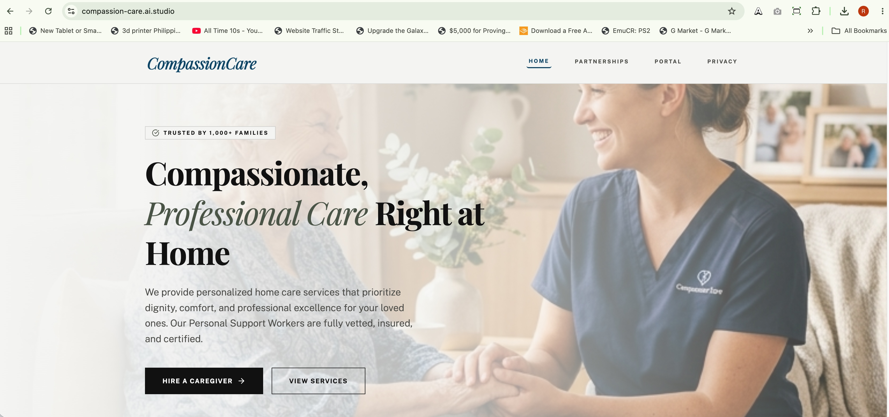
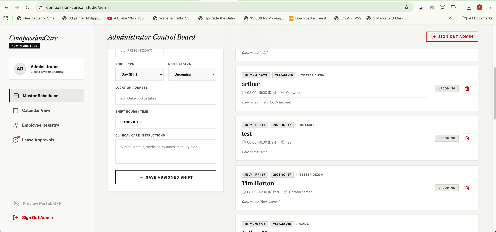
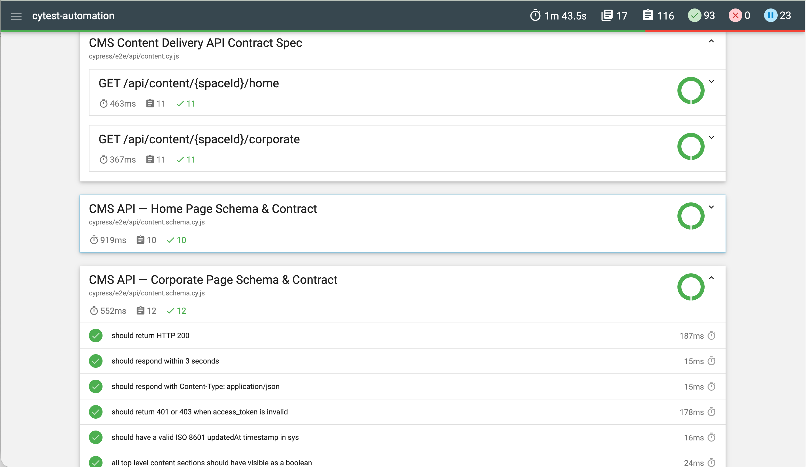
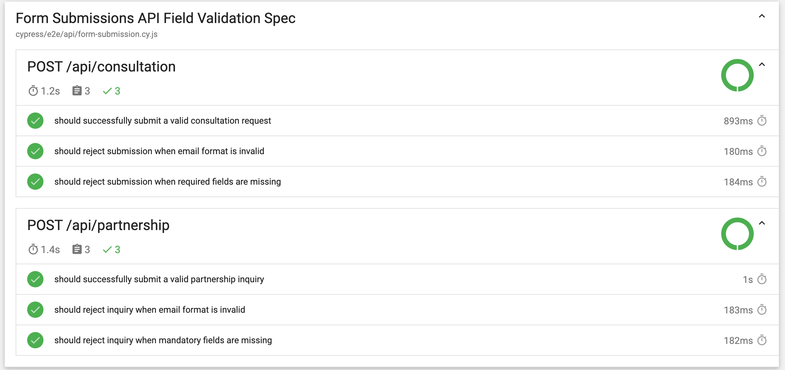
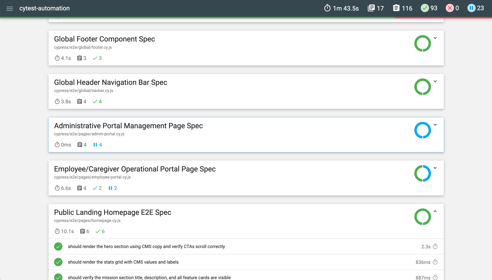

# CompassionCare Automated Test Suite

[](https://github.com/rodlesterldizon-collab/cytest-automation/actions/workflows/cypress.yml)
[](https://www.cypress.io/)
[](https://nodejs.org/)
[](https://developer.mozilla.org/en-US/docs/Web/JavaScript)
[](https://github.com/features/actions)
[](https://firebase.google.com/)
[](https://cloud.google.com/iam)

A production-grade, end-to-end (E2E) and REST API test automation suite built for **CompassionCare**.

> 💡 **Full-Stack Application & Test Suite Ownership**  
> I designed and built both the **CompassionCare Web Application** and this **Automated Test Suite**:
> - **Web Application**: Live on [https://compassion-care.ai.studio/](https://compassion-care.ai.studio/) (and [Partners Portal](https://compassion-care.ai.studio/partners)).
> - **Build & Prototyping Tools**: Developed using **Google AI Studio** and **Google Stitch** ([Stitch Project Workspace](https://stitch.withgoogle.com/projects/16471046710454731749)).
> - **Backend & Infrastructure**: Integrated **Firebase (Firestore DB)** for real-time database persistence and configured **Google IAM (Identity and Access Management)** policies to resolve access control and permissions.

---

## 🖥️ Application Under Test

| Live Homepage | Admin Portal Dashboard |
|:---:|:---:|
|  |  |
| [compassion-care.ai.studio/](https://compassion-care.ai.studio/) | [compassion-care.ai.studio/admin](https://compassion-care.ai.studio/admin) |

---

## 🚀 Key Highlights & Capabilities
- **API-Driven Assertions**: Page-level specs (`homepage.cy.js`, `partners.cy.js`) fetch live content from the CMS Content Delivery API via the `setupCmsPage` helper before each test. All text assertions — headings, CTAs, labels, pills, and descriptions — are validated against the API response, not hardcoded strings. If copy changes in the CMS, the tests automatically reflect it without code changes.
- **Helper & Utility Architecture**: Encapsulates common setup and CMS fetching into modular ES modules (`cypress/support/helpers.js`), keeping specs completely clean and free of mutable top-level variables.
- **Lift & Run Locally**: Strictly environment-decoupled; can be targeted at local development, sandbox, preview, or production instances without code changes.
- **Fast CI/CD & Automated Artifacts**: Powered by GitHub Actions using `cypress/included:13.17.0`. Automatically uploads HTML reports (`cypress-html-report`), failure screenshots (`cypress-screenshots`), and videos (`cypress-videos`) on every run.
- **Responsive Viewport Coverage**: Dedicated mobile (iPhone-X, 375x812) and tablet (iPad-2, 768x1024) spec files for both homepage and partners pages validate layout integrity across all device breakpoints.
- **Resilient Selectors**: Uses accessibility-first query strategies (`@testing-library/cypress`) rather than brittle CSS styling classes.

---

## 📂 Repository Structure
```text
cytest-automation/
├── .github/
│   └── workflows/
│       └── cypress.yml           # GitHub Actions CI/CD workflow (cypress/included container)
├── cypress.config.js             # Parses environment variables & configures Cypress
├── .env.tests                    # Target environment configuration & account credentials
├── CYPRESS_TEST_specification.md # Architectural test specifications & audit map
├── docs/
│   └── screenshots/              # Documentation assets (homepage, partners, CI, reports)
├── package.json                  # Dependencies & test runner CLI/UI scripts
└── cypress/
    ├── support/
    │   ├── e2e.js                # Global Cypress setup & custom overrides
    │   ├── commands.js           # Custom command bindings (e.g., cy.loginProgrammatic)
    │   └── helpers.js            # Reusable ES module helper functions (e.g., setupCmsPage, fetchCmsContent)
    ├── fixtures/
    │   ├── homeData.json         # Consultation form input samples (desktop, mobile, tablet, invalid, incomplete)
    │   └── partnersData.json     # Partnership inquiry input samples (desktop, mobile, tablet, invalid, incomplete)
    └── e2e/
        ├── api/                  # Pure REST API endpoint & schema contract tests
        ├── global/               # Navbar & Footer component tests
        └── pages/                # Page-level UI and user interaction specs
```

---

## 🧪 Complete Test Suite Coverage

### 📊 Test Execution Summary

| Metric | Count | Percentage | Description |
| :--- | :---: | :---: | :--- |
| **Total Test Cases Designed** | **116** | **100%** | Complete suite of E2E, Component, and REST API contract test cases (`[Test-001]`–`[Test-116]`) |
| **Active Executing Tests (CI)** | **96** | **82.8%** | Fully automated, actively executed and passing on every CI build run |
| **Skipped Tests (`it.skip`)** | **20** | **17.2%** | Designed & implemented; skipped on demo host due to free-tier backend rate limits (`HTTP 429`) |

---

### 💡 Architectural Awareness & Free-Tier Infrastructure Limitations

This test automation suite is engineered to reflect enterprise-grade practices while consciously addressing free-tier cloud hosting boundaries:

1. **Free-Tier Rate-Limit Protection (`HTTP 429`)**:
   - **Infrastructure Context**: The application is deployed on Google Cloud Platform & Firebase under a personal, non-paid Gmail account.
   - **Rate Limiting Limitation**: Rapid automated authentication loops fire sequential `POST /api/auth/login` and administrative API calls, triggering aggressive free-tier throttling (`429 Too Many Requests`).
   - **Mitigation Strategy**: Rather than causing false-positive CI pipeline failures against public free-tier endpoints, sensitive auth and admin operational specs (`auth.cy.js`, `admin.cy.js`, `portal.cy.js`) are preserved in code but set to `it.skip` on CI. The full test logic remains production-ready for execution against dedicated enterprise sandboxes or paid corporate environments.

2. **API-Driven Copy Assertions vs. Business Copy Regressions**:
   - **Integration Strategy**: `setupCmsPage` fetches live CMS payloads before page navigation, ensuring text assertions adapt automatically to copy updates without hardcoded strings.
   - **Defect Awareness**: Comparing rendered DOM text against live CMS data verifies UI rendering, but could accept invalid CMS copy as expected truth if the CMS itself has errors.
   - **Production Standard**: In enterprise environments, this trade-off is resolved by executing content validation tests against the CMS **Preview Environment** prior to production deployment.

---

### 🌐 1. User Interface (UI) Specs (`cypress/e2e/pages/`) — 45 Tests (38 Active, 7 Skipped)
| Spec File | Total / Status | Area Tested | Key Validations & Scenarios |
| :--- | :---: | :--- | :--- |
| `login.cy.js` | 4 (3 Active, 1 Skipped) | Identity & Access | Form field inputs, modal dialogs, IT Support intake, Google SSO integration |
| `homepage.cy.js` | 6 Active | Landing & Services (Desktop) | Hero badge/headings/CTAs, stats grid, mission section, all 4 service cards, consultation form, contact info — all text driven by the `home` CMS API via `setupCmsPage('home', '/')` |
| `homepage.mobile.cy.js` | 5 Active | Landing & Services (Mobile) | iPhone-X viewport (375x812) layout validation, mobile stacked grids, touch targets, and consultation form |
| `homepage.tablet.cy.js` | 5 Active | Landing & Services (Tablet) | iPad-2 viewport (768x1024) layout validation, 2x2 stats grid, tablet component sizing, and consultation form |
| `partners.cy.js` | 8 Active | B2B Partnerships (Desktop) | Hero, how-it-works, 3 bento feature cards, interactive ROI calculator (labels, care levels, impact panel, computed values), testimonial, inquiry form, contact info — all text driven by the `corporate` CMS API via `setupCmsPage('corporate', '/partners')` |
| `partners.mobile.cy.js` | 4 Active | B2B Partnerships (Mobile) | iPhone-X viewport (375x812) layout validation, stacked bento cards, ROI calculator, and inquiry form |
| `partners.tablet.cy.js` | 4 Active | B2B Partnerships (Tablet) | iPad-2 viewport (768x1024) layout validation, tablet bento grid, ROI calculator, and inquiry form |
| `admin-portal.cy.js` | 4 Skipped | Admin Dashboard | Dashboard rendering, employee roster management, shift scheduling, leave auditing *(Skipped due to rate limits)* |
| `employee-portal.cy.js` | 4 (2 Active, 2 Skipped) | Caregiver Portal | Shift schedule view, interactive clock-in/clock-out timecard, caregiver profile details |

### 🧩 2. Global Component Specs (`cypress/e2e/global/`) — 7 Tests (7 Active)
| Spec File | Total / Status | Area Tested | Key Validations & Scenarios |
| :--- | :---: | :--- | :--- |
| `navbar.cy.js` | 4 Active | Header Navigation | Brand logo, unauthenticated page links, smooth navigation to B2B Partners, Login, and Privacy Policy |
| `footer.cy.js` | 3 Active | Footer Component | Company branding, legal disclaimers, external links, copyright notice |

### 🔌 3. REST API Contract Specs (`cypress/e2e/api/`) — 64 Tests (51 Active, 13 Skipped)
| Spec File | Total / Status | Area Tested | Key Validations & Scenarios |
| :--- | :---: | :--- | :--- |
| `auth.cy.js` | 4 (1 Active, 3 Skipped) | Authentication API | `POST /api/auth/login` credentials check, `GET /api/auth/me` session check, 401 error handling |
| `admin.cy.js` | 3 (1 Active, 2 Skipped) | Admin Control API | `POST /api/admin/add-employee`, employee status toggles, schedule creation & deletion |
| `portal.cy.js` | 8 Skipped | Employee Portal API | `GET /api/portal/schedules`, timecard `clock-in`/`clock-out`, leave request submission *(Designed; `it.skip` on CI due to free-tier rate limits)* |
| `content.cy.js` | 22 Active | CMS Content API | `GET /api/content/{spaceId}/{pageId}` contract validation for `home` and `corporate` page payloads |
| `content.schema.cy.js` | 22 Active | AJV Schema & Security | AJV JSON Schema validation for form fields, HTTP 401/403 auth checks, 404 handling, response duration (<3s) |
| `form-submission.cy.js` | 6 Active | Form Input Validation | `POST /api/consultation` and `POST /api/partnership` field validations (valid 200, invalid email format rejection 400/422, missing required fields 400/422) |

---

### 📡 API Test Specifications & Validation Strategy

The API test suite (`cypress/e2e/api/`) validates backend endpoints and CMS data delivery independently of the UI:

1. **CMS Data Contract Specs (`content.cy.js`)**:
   - **`GET /api/content/{spaceId}/home`**: Validates status 200, metadata (`sys` object), and top-level sections (`hero`, `stats`, `about`, `services`, `contact`).
   - **`GET /api/content/{spaceId}/corporate`**: Validates status 200, `sys` object, and top-level sections (`navigation`, `hero`, `howItWorks`, `features`, `calculator`, `testimonial`, `inquiry`, `contact`).

2. **AJV JSON Schema & Security Gating (`content.schema.cy.js`)**:
   - **Form Schema Validation (AJV)**: Validates `contact.form` (Home) and `inquiry.fields` (Corporate) against strict JSON schemas.
   - **Security Gating**: Verifies missing or invalid `access_token` values return HTTP `401 Unauthorized` or `403 Forbidden`.
   - **Error Handling**: Verifies invalid page IDs return HTTP `404 Not Found`.
   - **SLA & Headers**: Ensures response time is under 3000ms and `Content-Type` is `application/json`.

3. **Form Input Validation API Specs (`form-submission.cy.js`)**:
   - **`POST /api/consultation`**:
     - ✅ **Valid Submission**: Sends compliant consultation payload, asserts HTTP 200 response.
     - ❌ **Invalid Email**: Sends invalid email format (e.g. `"invalid-email-format"`), asserts HTTP 400/422 validation failure.
     - ❌ **Missing Fields**: Sends incomplete payload, asserts HTTP 400/422 validation failure.
   - **`POST /api/partnership`**:
     - ✅ **Valid Submission**: Sends compliant partnership inquiry, asserts HTTP 200 response.
     - ❌ **Invalid Email**: Sends malformed email string, asserts HTTP 400/422 validation failure.
     - ❌ **Missing Fields**: Sends missing mandatory parameters, asserts HTTP 400/422 validation failure.

4. **Authentication & Operations API Specs (`auth.cy.js`, `admin.cy.js`, `portal.cy.js`)**:
   - **Designed Scenarios**: Full coverage for valid administrator/caregiver login, secure `CC_SESSION` HttpOnly cookie set/purge, session validation without password leakage, invalid credential rejection, employee management, and shift/leave operations.
   - **Free-Tier Account & Rate Limit Constraints (`it.skip`)**: The target application is hosted on a free-tier Google Cloud / Firebase account using a personal (non-paid corporate) Gmail account. The free tier enforces strict rate limits that return HTTP `429 Too Many Requests` when executing rapid automated auth calls. To prevent false-positive CI pipeline failures on this public free-tier host, these specs are set to `it.skip` on CI while preserving complete, production-ready test implementations for paid corporate environments.

---

## 🔑 CMS Content Delivery API

Page-level specs fetch live content from the **CompassionCare CMS** before each test run. Credentials are read from environment variables — never hardcoded.

| Variable | Description | Source |
| :--- | :--- | :--- |
| `CYPRESS_content_api_base_url` | CMS API base URL | `.env.tests` / GitHub Variable |
| `CYPRESS_space_id` | CMS Space ID | `.env.tests` / GitHub Variable |
| `CYPRESS_access_token` | Content Delivery API token | `.env.tests` / GitHub Secret |

**Supported page IDs**: `home`, `corporate`, `footer`, `privacy`, `terms`, `navigation`, `admin-portal`, `employee-portal`

> The `/partners` page on the live site maps to the `corporate` CMS page ID.

> ⚠️ **CMS Content Verification & Business Regression Note**  
> The `setupCmsPage` helper fetches current CMS content before visiting the route, and page assertions compare rendered text with that live response. This avoids hardcoding copy and is valuable for integration testing. However, it can also hide a business regression: if the CMS contains incorrect content, the test may accept the incorrect content as the expected result.  
>  
> In order to avoid this, since this is a demo it only uses the staging demo data. On a real live site to cover business regressions, the content may be tested on the preview environment of the CMS to avoid business-related defects.

---

## 🛠️ Quickstart & Local Execution

### 1. Installation
```bash
npm install
```

### 2. Configure Target Environment (`.env.tests`)
Configure your target URL and credentials using placeholder format:
```env
# Target Environment URL - Change to run tests against local, Sandbox, or Production
CYPRESS_baseUrl=https://compassion-care.ai.studio/

# Credentials (Placeholders)
CYPRESS_adminEmail=admin@example.com
CYPRESS_adminPassword=your_admin_password
CYPRESS_employeeEmail=employee@example.com
CYPRESS_employeePassword=your_employee_password

CYPRESS_MOCK_API=true

# CMS Content Delivery API
CYPRESS_content_api_base_url=https://compassion-care.ai.studio/api/content
CYPRESS_space_id=your_space_id
CYPRESS_access_token=your_access_token
```

### 3. Run Commands

#### Interactive GUI Mode (Cypress Test Runner)
```bash
npm run test:ui
```

#### Headless CLI Mode
```bash
# Run all tests in terminal
npm run test:cli

# Run specifically in Chrome
npm run test:cli:chrome

# Run a specific spec file
npm run test:cli:spec
```

---

## ⚡ Fast CI/CD Integration & Artifact Reporting

The repository includes an automated GitHub Actions workflow (`.github/workflows/cypress.yml`).

To optimize pipeline speed, the workflow runs inside the official pre-built Docker container (`cypress/included:13.17.0`). Because Node.js and Cypress are pre-installed in the container image, the pipeline skips repetitive binary downloads and starts executing tests almost instantly.

CMS credentials (`CYPRESS_access_token`, `CYPRESS_space_id`, `CYPRESS_content_api_base_url`) are stored as **GitHub Secrets/Variables** and injected at runtime — no credentials are committed to the repository.

### Cypress Test Runner — Live Results

| CMS API Contract & Schema Specs | Form Submission Validation Spec |
|:---:|:---:|
|  |  |
| `content.cy.js` · `content.schema.cy.js` — 44 assertions ✅ | `form-submission.cy.js` — 6 assertions ✅ |

| Homepage & Global Component Specs |
|:---:|
|  |
| `homepage.cy.js` (6 passing) · `navbar.cy.js` (4 passing) · `footer.cy.js` (3 passing) ✅ |

> [View All CI Runs →](https://github.com/rodlesterldizon-collab/cytest-automation/actions)

### Artifacts Captured & Uploaded on Every CI Run:
1. 📄 **`cypress-html-report`**: Interactive Mochawesome HTML report (`cypress/reports/index.html`).
2. 📸 **`cypress-screenshots`**: Captured PNG failure screenshots (`cypress/screenshots`).
3. 🎥 **`cypress-videos`**: Full test execution video MP4 recordings (`cypress/videos`).

---

## 🏆 Engineering Best Practices Applied

- **Clean Helper Functions (`setupCmsPage`)**: Uses modular ES module imports (`cypress/support/helpers.js`) to handle API requests and route navigation in a single line, retrieving data via thread-safe Cypress aliases (`cy.get('@home')`) without mutable global variables (`let home`).
- **API-Driven Content Assertions**: Page specs call the CMS Content Delivery API in `beforeEach` and alias the response. All `have.text` / `contain.text` assertions use live API data — zero hardcoded copy strings.
- **Fixture-Driven Test Data**: Form input samples (valid, invalid, incomplete) for all pages are centralized in `cypress/fixtures/homeData.json` and `partnersData.json` — referenced by viewport context (`desktop`, `mobile`, `tablet`).
- **Explicit Per-Element Testing**: Service cards, bento grid cards, highlight pills, and list items are tested individually (no programmatic loops) for clear failure isolation and readable test output.
- **Responsive Viewport Testing**: Dedicated `*.mobile.cy.js` (375x812) and `*.tablet.cy.js` (768x1024) spec files validate layout integrity across device breakpoints using `cy.viewport()`.
- **Programmatic Session Caching (`cy.session()`)**: Bypasses slow UI logins for authenticated test setup, reducing execution time by up to 85%.
- **Accessibility-First Selectors (`@testing-library/cypress`)**: Uses `cy.findByRole()` and `cy.findByLabelText()` to keep tests decoupled from CSS styling or Tailwind class refactors.
- **Flexible Waiting Strategies**: Employs dynamic polling (`fluentWait`) and optional explicit delays (`explicitWait`) rather than brittle fixed sleeps.
- **Environment Isolation**: Dynamic configuration parsing (`cypress.config.js`) allows seamless switching between local dev server, preview builds, and live production environments.

---

### 🎯 Element Selector Strategy & Locator Architecture

The test suite leverages a pragmatic, hybrid selector hierarchy that balances idiomatic Cypress code, test stability, and DOM scope isolation:

1. **Accessibility-First Semantic Selectors (`@testing-library/cypress`)**:
   - **Pattern**: `cy.findByRole('button', { name: /request consultation/i })`, `cy.findByLabelText(/email/i)`
   - **Rationale**: Preferred for primary CTAs, accessible form controls, and key user actions to align tests with real user behavior and decouple assertions from styling refactors.

2. **Standard Cypress DOM & Attribute Selectors (Native Cypress)**:
   - **Pattern**: `cy.get('input[name="name"]')`, `cy.get('#password')`, `cy.contains('Forgot Password?')`
   - **Rationale**: Standard, idiomatic Cypress locators used throughout the suite for form inputs, element IDs, and text assertions — providing clean, fast, and readable test code.

3. **Component Container Anchoring (`.within()`)**:
   - **Pattern**: `cy.get('#contact').within(() => { ... })` / `cy.get('#services').within(() => { ... })`
   - **Rationale**: Establishes strict component boundaries before executing child queries, eliminating global DOM search pollution and preventing false-positive matches across distant page sections.

4. **Scoped Collection Indexing for Dynamic CMS Arrays**:
   - **Pattern**: `cy.get('.grid > div').eq(i)` inside an anchored `.within()` container
   - **Rationale**: Applied specifically when iterating over dynamic CMS collection arrays (e.g., 4 service cards, 4 metric counters) returned by the Content Delivery API, where cards share identical structural templates without unique static accessibility roles.
